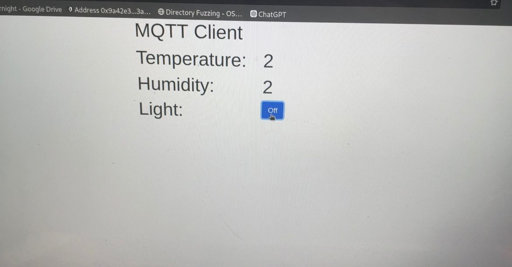

# Final Project Integrasi Sistem

**Kelompok 7**
| Nama | NRP |
|-----------------------|--------------|
| Sylvia Febrianti | 5027221019 |
| Stephanie Hebrina Mabunbun Simatupang| 5027221069 |

## Project 1 

Pada project 1, kami diminta untuk mengembangkan sebuah sistem yang mengintegrasikan sensor DHT dengan ESP8266 untuk mengukur suhu dan kelembaban, mengirimkan data tersebut ke broker MQTT, dan kemudian menampilkannya pada halaman web.

Project 1 terdapat 
1. MQTT2Wemos.ino
2. index.html 

### MQTT2Wemos.ino
```
#include <Adafruit_Sensor.h>
#include <DHT.h>
#include <DHT_U.h>
#include <ESP8266WiFi.h>
#include <PubSubClient.h>

// Update these with values suitable for your network.
const char* ssid = "halooo";     // Nama Wi-Fi
const char* pswd = "11111118";   // Password Wi-Fi
const char* mqtt_server = "167.172.87.186"; // IP Broker MQTT
const char* topic = "/kel07/room/temperature"; // Topik untuk mempublikasikan data

long timeBetweenMessages = 1000 * 20 * 1;  // Waktu jeda antar pesan (20 detik)

WiFiClient espClient;         // Objek untuk koneksi Wi-Fi
PubSubClient client(espClient); // Objek untuk klien MQTT
long lastMsg = 0;             // Waktu pengiriman pesan terakhir
int value = 0;
int status = WL_IDLE_STATUS;  // Status awal Wi-Fi

#define DHTPIN 5              // Pin digital yang terhubung ke sensor DHT
#define DHTTYPE DHT11         // Jenis sensor DHT (DHT11 atau DHT22)
DHT_Unified dht(DHTPIN, DHTTYPE); // Objek sensor DHT
uint32_t delayMS;             // Waktu tunda antar pengukuran
```

Menghubungkan ke Wi-Fi :
```
void setup_wifi() {
  delay(10);
  Serial.println();
  Serial.print("Connecting to ");
  Serial.println(ssid);

  WiFi.begin(ssid, pswd); // Menghubungkan ke Wi-Fi

  // Menunggu hingga terhubung ke Wi-Fi
  while (WiFi.status() != WL_CONNECTED) {
    delay(500);
    Serial.print(".");
  }

  Serial.println("");
  Serial.println("WiFi connected");
  Serial.println("IP address: ");
  Serial.println(WiFi.localIP()); // Menampilkan alamat IP
}
```

Callback MQTT untuk mengatur pesan yang diterima :
```
void callback(char* topic, byte* payload, unsigned int length) {
  Serial.print("Message arrived [");
  Serial.print(topic);
  Serial.print("] ");
  for (int i = 0; i < length; i++) {
    Serial.print((char)payload[i]);
  }
  Serial.println();

  // Menghidupkan atau mematikan LED bawaan berdasarkan pesan yang diterima
  if ((char)payload[0] == '1') {
    digitalWrite(BUILTIN_LED, LOW); // Menyalakan LED
  } else {
    digitalWrite(BUILTIN_LED, HIGH); // Mematikan LED
  }
}
```

Mengubah MAC Address menjadi string &  membuat client ID :
```
String macToStr(const uint8_t* mac) {
  String result;
  for (int i = 0; i < 6; ++i) {
    result += String(mac[i], 16);
    if (i < 5)
      result += ':';
  }
  return result;
}
String composeClientID() {
  uint8_t mac[6];
  WiFi.macAddress(mac);
  String clientId = "esp-";
  clientId += macToStr(mac);
  return clientId;
}
```

Menghubungkan ke Broker MQTT kalau koneksi putus :
```
void reconnect() {
  while (!client.connected()) {
    Serial.print("Attempting MQTT connection...");
    String clientId = composeClientID() + "-" + String(micros() & 0xff, 16); // Membuat ID klien unik

    // Mencoba untuk terhubung ke broker MQTT
    if (client.connect(clientId.c_str(), username, password)) {
      Serial.println("connected");
      String subscription = String(topic) + "/" + composeClientID() + "/in";
      client.subscribe(subscription.c_str()); // Berlangganan ke topik
      Serial.print("subscribed to : ");
      Serial.println(subscription);
    } else {
      Serial.print("failed, rc=");
      Serial.print(client.state());
      Serial.print(" wifi=");
      Serial.print(WiFi.status());
      Serial.println(" try again in 5 seconds");
      delay(5000); // Menunggu 5 detik sebelum mencoba kembali
    }
  }
}
```

Setup & loop :
```
void setup() {
  Serial.begin(115200);
  // Initialize device.
  dht.begin();

  //Setup WIFI & MQTT Broker connection
  setup_wifi();
  client.setServer(mqtt_server, 1883);
  client.setCallback(callback);
  
  Serial.println(F("DHTxx Unified Sensor Example"));
  // Print temperature sensor details.
  sensor_t sensor;
  dht.temperature().getSensor(&sensor);
  Serial.println(F("------------------------------------"));
  Serial.println(F("Temperature Sensor"));
  Serial.print  (F("Sensor Type: ")); Serial.println(sensor.name);
  Serial.print  (F("Driver Ver:  ")); Serial.println(sensor.version);
  Serial.print  (F("Unique ID:   ")); Serial.println(sensor.sensor_id);
  Serial.print  (F("Max Value:   ")); Serial.print(sensor.max_value); Serial.println(F("°C"));
  Serial.print  (F("Min Value:   ")); Serial.print(sensor.min_value); Serial.println(F("°C"));
  Serial.print  (F("Resolution:  ")); Serial.print(sensor.resolution); Serial.println(F("°C"));
  Serial.println(F("------------------------------------"));
  // Print humidity sensor details.
  dht.humidity().getSensor(&sensor);
  Serial.println(F("Humidity Sensor"));
  Serial.print  (F("Sensor Type: ")); Serial.println(sensor.name);
  Serial.print  (F("Driver Ver:  ")); Serial.println(sensor.version);
  Serial.print  (F("Unique ID:   ")); Serial.println(sensor.sensor_id);
  Serial.print  (F("Max Value:   ")); Serial.print(sensor.max_value); Serial.println(F("%"));
  Serial.print  (F("Min Value:   ")); Serial.print(sensor.min_value); Serial.println(F("%"));
  Serial.print  (F("Resolution:  ")); Serial.print(sensor.resolution); Serial.println(F("%"));
  Serial.println(F("------------------------------------"));
  // Set delay between sensor readings based on sensor details.
  delayMS = 30000;
}

void loop() {
  // Delay between measurements.
  delay(delayMS);
  // Get temperature event and print its value.
  sensors_event_t event;
  dht.temperature().getEvent(&event);
  float temp=0;
  if (isnan(event.temperature)) {
    Serial.println(F("Error reading temperature!"));
  }
  else {
    Serial.print(F("Temperature: "));
    Serial.print(event.temperature);
    Serial.println(F("°C"));
    temp=event.temperature;
  }

  
  // Get humidity event and print its value.
  dht.humidity().getEvent(&event);
  float hum=0;
  if (isnan(event.relative_humidity)) {
    Serial.println(F("Error reading humidity!"));
  }
  else {
    Serial.print(F("Humidity: "));
    Serial.print(event.relative_humidity);
    Serial.println(F("%"));
    hum=event.relative_humidity;
  }


    // confirm still connected to mqtt server
  if (!client.connected()) {
    reconnect();
  }
  client.loop();

  String payload = "{\"Temp\":";
  payload += temp;
  payload += ",\"Hum\":";
  payload += hum;
  payload += "}";
  String pubTopic;
   pubTopic += topic;
  Serial.print("Publish topic: ");
  Serial.println(pubTopic);
  Serial.print("Publish message: ");
  Serial.println(payload);
  client.publish( (char*) pubTopic.c_str() , (char*) payload.c_str(), true );

  delay(5000);
}
```

Penjelasan Code diatas :
1. Mengukur Data Suhu dan Kelembaban dengan sensor DHT yang terhubung ke  ESP8266.
2. Mengirim Data ke Broker MQTT
3. Menampilkan Data pada Halaman Web MQTT


### index.html 
```
<!doctype html>
<html lang="en">
  <head>
    <title>Title</title>
    <!-- Required meta tags -->
    <meta charset="utf-8">
    <meta name="viewport" content="width=device-width, initial-scale=1, shrink-to-fit=no">

    <!-- Bootstrap CSS -->
    <link rel="stylesheet" href="https://stackpath.bootstrapcdn.com/bootstrap/4.3.1/css/bootstrap.min.css" integrity="sha384-ggOyR0iXCbMQv3Xipma34MD+dH/1fQ784/j6cY/iJTQUOhcWr7x9JvoRxT2MZw1T" crossorigin="anonymous">
  </head>
  <body>
      <div class="continer-fluid">
          <div class="row justify-content-center">
              <div class="col-3">
                <h1>MQTT Client</h1>
              </div>
          </div>
          <div class="row justify-content-center">
            <div class="col-2">
              <h1>Temperature:</h1>
            </div>
            <div class="col-1">
                <h1 id="Room-Temp">2</h1>
              </div>
        </div>
        <div class="row justify-content-center">
            <div class="col-2">
              <h1>Humidity:</h1>
            </div>
            <div class="col-1">
                <h1 id="Room-Hum">2</h1>
              </div>
        </div>

      </div>
    <!-- Optional JavaScript -->
    <!-- jQuery first, then Popper.js, then Bootstrap JS -->
    <script src="https://code.jquery.com/jquery-3.3.1.slim.min.js" integrity="sha384-q8i/X+965DzO0rT7abK41JStQIAqVgRVzpbzo5smXKp4YfRvH+8abtTE1Pi6jizo" crossorigin="anonymous"></script>
    <script src="https://cdnjs.cloudflare.com/ajax/libs/popper.js/1.14.7/umd/popper.min.js" integrity="sha384-UO2eT0CpHqdSJQ6hJty5KVphtPhzWj9WO1clHTMGa3JDZwrnQq4sF86dIHNDz0W1" crossorigin="anonymous"></script>
    <script src="https://stackpath.bootstrapcdn.com/bootstrap/4.3.1/js/bootstrap.min.js" integrity="sha384-JjSmVgyd0p3pXB1rRibZUAYoIIy6OrQ6VrjIEaFf/nJGzIxFDsf4x0xIM+B07jRM" crossorigin="anonymous"></script>

    <!--MQTT Poho Javascript Library-->
    <script src="https://cdnjs.cloudflare.com/ajax/libs/paho-mqtt/1.0.1/mqttws31.min.js" type="text/javascript"></script>
    <script type="text/javascript">
        $(document).ready(function(){

            /** Write Your MQTT Settings Here  Start**/
            Server="167.172.87.186";
            Port="9000";
            Topic="/kel07/room/temperature";

            // Generate a random client ID
            clientID = "clientID_" + parseInt(Math.random() * 100);

            // Create a client instance
            client=new Paho.MQTT.Client(Server,Number(Port),clientID);


            // set callback handlers
            client.onConnectionLost = onConnectionLost;
            client.onMessageArrived = onMessageArrived;

            options = {
              timeout: 3,
              //Gets Called if the connection has successfully been established
              onSuccess: function () {
                  onConnect();
              },
              //Gets Called if the connection could not be established
              onFailure: function (message) {
                  console.log("On failure="+message.errorMessage);
                  onFailt(message.errorMessage);
                  //alert("Connection failed: " + message.errorMessage);
              }
            };
            // connect the client
            client.connect(options);
        });

        // called when the client connects
        function onConnect() {
            // Once a connection has been made, make a subscription and send a message.
            console.log("onConnect");
            client.subscribe(Topic);
        }

        // called when the client loses its connection
        function onConnectionLost(responseObject) {
            if (responseObject.errorCode !== 0) {
                console.log("onConnectionLost:"+responseObject.errorMessage);
            }
        }

        // called when a message arrives
        function onMessageArrived(message) {
            var MQTTDataObject = JSON.parse(message.payloadString);
            $("#Room-Temp").text(MQTTDataObject.Temp+" C");
            $("#Room-Hum").text(MQTTDataObject.Hum+" %");
            console.log(MQTTDataObject.Hum);
            console.log(MQTTDataObject.Temp);
             console.log("onMessageArrived:"+message.payloadString);
        }
    </script>
  </body>
</html>
```

Code index.html digunakan untuk mengatur MQTT di halaman web

### Dokumentasi Project 1


## Project 2
Pada project 2, kami diminta untuk membuat sistem monitoring suhu dan kelembaban menggunakan sensor DHT11 yang terhubung dengan ESP8266, dan kemudian mengendalikan LED pada Raspberry Pi berdasarkan suhu yang diterima melalui broker MQTT.

Project 1 terdapat 
1. MQTT2Wemos.ino
2. mqtt_pub.py
3. mqtt_sub.py 
4. index.html
5. blink.py

### MQTT2Wemos.ino

Connect wifi & setup wifi :
```
#include <Adafruit_Sensor.h>
#include <DHT.h>
#include <DHT_U.h>
#include <ESP8266WiFi.h>
#include <PubSubClient.h>


// Update these with values suitable for your network.

const char* ssid = "halooo";
const char* pswd = "11111118";

const char* mqtt_server = "167.172.87.186"; //Broker IP/URL
const char* topic = "/kel07/room/temperature";    //Topic

long timeBetweenMessages = 1000 * 20 * 1;

WiFiClient espClient;
PubSubClient client(espClient);
long lastMsg = 0;
int value = 0;

int status = WL_IDLE_STATUS;     // the starting Wifi radio's status


#define DHTPIN 5     // Digital pin connected to the DHT sensor 

// Uncomment the type of sensor in use:
#define DHTTYPE    DHT11     // DHT 11
//#define DHTTYPE    DHT22     // DHT 22 (AM2302)


DHT_Unified dht(DHTPIN, DHTTYPE);

uint32_t delayMS;


void setup_wifi() {
  delay(10);
  // We start by connecting to a WiFi network
  Serial.println();
  Serial.print("Connecting to ");
  Serial.println(ssid);
  WiFi.begin(ssid, pswd);
  while (WiFi.status() != WL_CONNECTED) {
    delay(500);
    Serial.print(".");
  }
  Serial.println("");
  Serial.println("WiFi connected");
  Serial.println("IP address: ");
  Serial.println(WiFi.localIP());
}

void callback(char* topic, byte* payload, unsigned int length) {
  Serial.print("Message arrived [");
  Serial.print(topic);
  Serial.print("] ");
  for (int i = 0; i < length; i++) {
    Serial.print((char)payload[i]);
  }
  Serial.println();

  // Switch on the LED if an 1 was received as first character
  if ((char)payload[0] == '1') {
    digitalWrite(BUILTIN_LED, LOW);   // Turn the LED on (Note that LOW is the voltage level
    // but actually the LED is on; this is because
    // it is acive low on the ESP-01)
  } else {
    digitalWrite(BUILTIN_LED, HIGH);  // Turn the LED off by making the voltage HIGH
  }
}

String macToStr(const uint8_t* mac)
{
  String result;
  for (int i = 0; i < 6; ++i) {
    result += String(mac[i], 16);
    if (i < 5)
      result += ':';
  }
  return result;
}

String composeClientID() {
  uint8_t mac[6];
  WiFi.macAddress(mac);
  String clientId;
  clientId += "esp-";
  clientId += macToStr(mac);
  return clientId;
}

void reconnect() {
  // Loop until we're reconnected
  while (!client.connected()) {
    Serial.print("Attempting MQTT connection...");

    String clientId = composeClientID() ;
    clientId += "-";
    clientId += String(micros() & 0xff, 16); // to randomise. sort of

    // Attempt to connect
    if (client.connect(clientId.c_str(),username,password)) {
      Serial.println("connected");
      String subscription;
      subscription += topic;
      subscription += "/";
      subscription += composeClientID() ;
      subscription += "/in";
      client.subscribe(subscription.c_str() );
      Serial.print("subscribed to : ");
      Serial.println(subscription);
    } else {
      Serial.print("failed, rc=");
      Serial.print(client.state());
      Serial.print(" wifi=");
      Serial.print(WiFi.status());
      Serial.println(" try again in 5 seconds");
      // Wait 5 seconds before retrying
      delay(5000);
    }
  }
}


void setup() {
  Serial.begin(115200);
  // Initialize device.
  dht.begin();

  //Setup WIFI & MQTT Broker connection
  setup_wifi();
  client.setServer(mqtt_server, 1883);
  client.setCallback(callback);
  
  Serial.println(F("DHTxx Unified Sensor Example"));
  // Print temperature sensor details.
  sensor_t sensor;
  dht.temperature().getSensor(&sensor);
  Serial.println(F("------------------------------------"));
  Serial.println(F("Temperature Sensor"));
  Serial.print  (F("Sensor Type: ")); Serial.println(sensor.name);
  Serial.print  (F("Driver Ver:  ")); Serial.println(sensor.version);
  Serial.print  (F("Unique ID:   ")); Serial.println(sensor.sensor_id);
  Serial.print  (F("Max Value:   ")); Serial.print(sensor.max_value); Serial.println(F("°C"));
  Serial.print  (F("Min Value:   ")); Serial.print(sensor.min_value); Serial.println(F("°C"));
  Serial.print  (F("Resolution:  ")); Serial.print(sensor.resolution); Serial.println(F("°C"));
  Serial.println(F("------------------------------------"));
  // Print humidity sensor details.
  dht.humidity().getSensor(&sensor);
  Serial.println(F("Humidity Sensor"));
  Serial.print  (F("Sensor Type: ")); Serial.println(sensor.name);
  Serial.print  (F("Driver Ver:  ")); Serial.println(sensor.version);
  Serial.print  (F("Unique ID:   ")); Serial.println(sensor.sensor_id);
  Serial.print  (F("Max Value:   ")); Serial.print(sensor.max_value); Serial.println(F("%"));
  Serial.print  (F("Min Value:   ")); Serial.print(sensor.min_value); Serial.println(F("%"));
  Serial.print  (F("Resolution:  ")); Serial.print(sensor.resolution); Serial.println(F("%"));
  Serial.println(F("------------------------------------"));
  // Set delay between sensor readings based on sensor details.
  delayMS = 30000;
}
```
Ambil data suhu dan kelembaban dari sensor DHT & kirim ke broker MQTT :
```
void loop() {
  // Delay between measurements.
  delay(delayMS);
  // Get temperature event and print its value.
  sensors_event_t event;
  dht.temperature().getEvent(&event);
  float temp=0;
  if (isnan(event.temperature)) {
    Serial.println(F("Error reading temperature!"));
  }
  else {
    Serial.print(F("Temperature: "));
    Serial.print(event.temperature);
    Serial.println(F("°C"));
    temp=event.temperature;
  }

  
  // Get humidity event and print its value.
  dht.humidity().getEvent(&event);
  float hum=0;
  if (isnan(event.relative_humidity)) {
    Serial.println(F("Error reading humidity!"));
  }
  else {
    Serial.print(F("Humidity: "));
    Serial.print(event.relative_humidity);
    Serial.println(F("%"));
    hum=event.relative_humidity;
  }


    // confirm still connected to mqtt server
  if (!client.connected()) {
    reconnect();
  }
  client.loop();

  String payload = "{\"Temp\":";
  payload += temp;
  payload += ",\"Hum\":";
  payload += hum;
  payload += "}";
  String pubTopic;
   pubTopic += topic;
  Serial.print("Publish topic: ");
  Serial.println(pubTopic);
  Serial.print("Publish message: ");
  Serial.println(payload);
  client.publish( (char*) pubTopic.c_str() , (char*) payload.c_str(), true );

  delay(5000);
}
```

code diatas untuk ESP8266 yang menggunakan sensor DHT untuk membaca suhu dan kelembaban, lalu mengirimkan data tersebut ke broker MQTT

### mqtt_pub.py 

Fungsi yang dijalankan saat client berhasil terkoneksi dengan broker MQTT :
```
import paho.mqtt.client as mqtt
import json

def on_connect(client, userdata, flags, rc):
    # subscribe, which need to put into on_connect
    # if reconnect after losing the connection with the broker, it will continue to subscribe to the raspberry/topic topic
    client.subscribe("/kel07/room/temperature")

# the callback function, it will be triggered when receiving messages
```

Fungsi yang dijalankan saat menerima pesan pada topik yang dilanggan :
```
def on_message(client, userdata, message):
    readings=str(message.payload.decode("utf-8"))
    print("message received " ,readings)
    JsonReadings=json.loads(readings)
    print("Temperature=",JsonReadings["Temp"])
    if JsonReadings["Temp"]>0:
        client.publish("/kel07/room/led","On")
    else:
        client.publish("/kel07/room/led","Off")

client = mqtt.Client()
client.on_connect = on_connect
client.on_message = on_message
# create connection, the three parameters are broker address, broker port number, and keep-alive time respectively
client.username_pw_set(username="",password="")
client.connect("167.172.87.186", 1883, 60)
# set the network loop blocking, it will not actively end the program before calling disconnect() or the program crash
client.loop_forever()
```

code diatas merupakan client MQTT, berlangganan pada topik /kel07/room/temperature, menerima pesan suhu, dan mengirimkan perintah ke topik /kel07/room/led

### mqtt_sub.py 
Fungsi yang dijalankan saat client berhasil terkoneksi dengan broker MQTT : 
```
import paho.mqtt.client as mqtt
import RPi.GPIO as GPIO # Import Raspberry Pi GPIO library
from time import sleep # Import the sleep function from the time module

GPIO.setwarnings(False) # Ignore warning for now
GPIO.setmode(GPIO.BOARD) # Use physical pin numbering
GPIO.setup(12, GPIO.OUT, initial=GPIO.LOW) # Set pin 8 to be an output pin and$

def on_connect(client, userdata, flags, rc):
    # subscribe, which need to put into on_connect
    # if reconnect after losing the connection with the broker, it will continue to subscribe to the raspberry/topic topic
    client.subscribe("/kel07/room/led")

```

Jika pesan diterima :
```
# the callback function, it will be triggered when receiving messages
def on_message(client, userdata, message):
    if str(message.payload.decode("utf-8"))=="On":
        GPIO.output(12, GPIO.HIGH) # Turn on
    else:
        GPIO.output(12, GPIO.LOW) # Turn Off
    print("message received " ,str(message.payload.decode("utf-8")))
    
client = mqtt.Client()
client.on_connect = on_connect
client.on_message = on_message
# create connection, the three parameters are broker address, broker port number, and keep-alive time respectively
client.username_pw_set(username="",password="")
client.connect("167.172.87.186", 1883, 60)
# set the network loop blocking, it will not actively end the program before calling disconnect() or the program crash
client.loop_forever()
```

code diatas berlangganan pada topik /kel07/room/led dan mengontrol LED berdasarkan pesan yang diterima

### blink.py
```
import RPi.GPIO as GPIO
from time import sleep

GPIO.setwarnings(False)
GPIO.setmode(GPIO.BOARD)
GPIO.setup(12, GPIO.OUT, initial=GPIO.LOW)

while True:
  GPIO.output(12, GPIO.HIGH)
  sleep(1)
  GPIO.output(12, GPIO.LOW)
  sleep(1)
````

code diatas ntuk Raspberry Pi yang mengedipkan LED yang terhubung ke pin GPIO 12 secara terus-menerus

### Dokumentasi Project 2
- LED mati


- temp `>0` bakal nyala


- LED on/nyala


- LED nyala


- Tampilan web 


